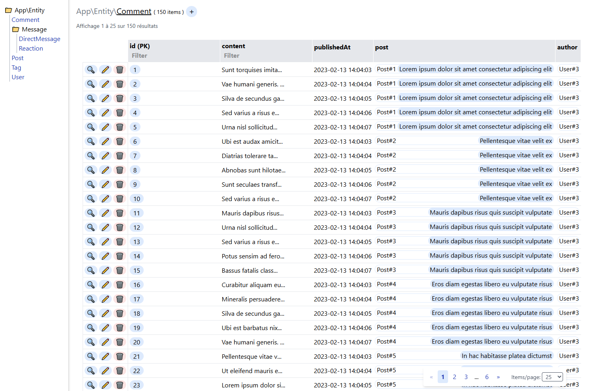
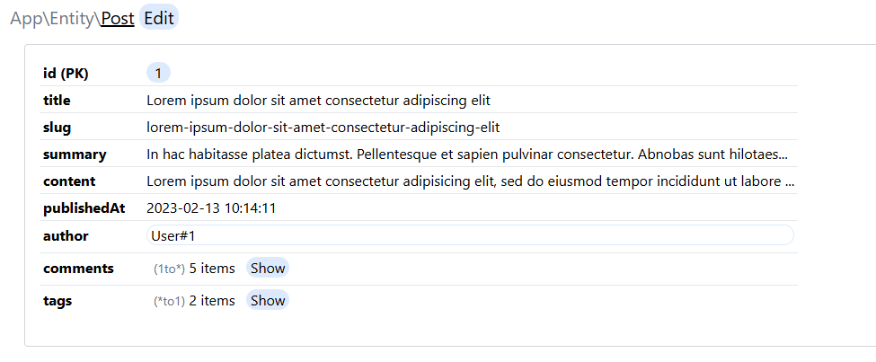
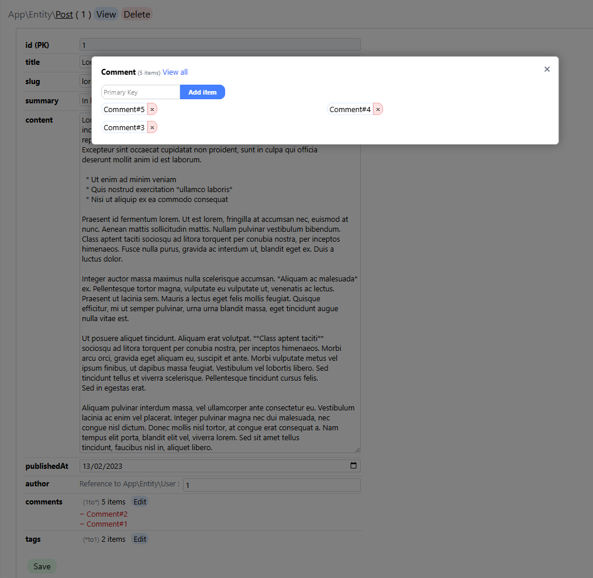

Description
================
This bundle generates admin pages automatically with no need for configuration.
You can manage your Doctrine entities (list, create, edit, delete and associations, when included in entities) 
The interface is simple and without clutter nor noise and makes use of `__toString()` methods to display meaningful information.
It only works with Single Column Identifiers for now but support for composite keys may be added in the future.

Installation
================
1. Run `composer require lalamefine/autoadmin`
2. If not done automatically, add the bundle in `config/bundles.php`:
    ```php
    return [
        // ...
        Lalamefine\Autoadmin\LalamefineAutoadminBundle::class => ['all' => true], // add this line
    ];
    ```
3. Add the route in `config/routes/autoadmin.yaml`:
    ```yaml
    autoadmin:
        resource: '@LalamefineAutoadminBundle/config/routes.yaml'
        prefix: autoadmin
    ```
    You can change the prefix if you want (e.g. `admin`).
4. __⚠ WARNING__ Configure security to restrict access :

    You need to configure security at routing level <br>
    I do recommand restricting `/autoadmin` (or your custom prefix) to a specific user role in `config/packages/security.yaml`.

    ```yaml
    security: 
        # ...
        access_control:
            - { path: ^/autoadmin, roles: ROLE_SUPER_ADMIN } # Add & customize this line
            # ...
    ```
Screenshots
================
From an improved version of the symfony sample project : https://github.com/symfony/demo
### List

### View

### Edition after comments's "Edit" button is clicked (and 2 elements flagged for removal)


License
================
This bundle is distributed under the LGPL-3.0-or-later license.
Basically, you can use and integrate the licensed software in proprietary projects, as long as modifications to the LGPL-covered code itself remain open-source and shared.
See the LICENSE file for more details.
